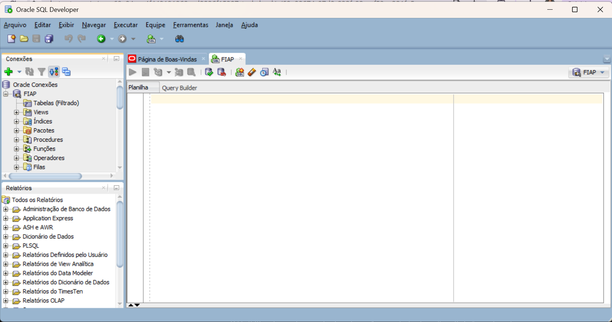
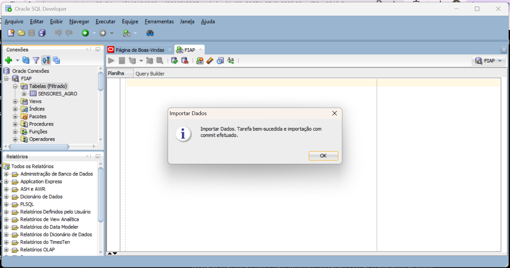
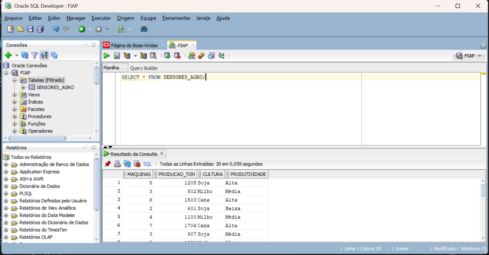

# Projeto PBL Fase 3 — Banco de Dados Oracle

## Integrantes

- Viktor Ribeiro Dos Santos Cunha — RM570917

---

# Objetivo

O objetivo deste projeto foi importar os dados coletados na Fase 2 para um banco de dados Oracle utilizando o Oracle SQL Developer.

Após a importação, foram realizadas consultas SQL para validação e exploração dos dados armazenados na tabela criada.

---

# Tecnologias Utilizadas

- Oracle SQL Developer
- Oracle Database
- SQL
- GitHub
- ESP32

---

# Passo a Passo Executado

## 1. Instalação do Oracle SQL Developer

Foi realizado o download e instalação do Oracle SQL Developer através do site oficial da Oracle.

---

## 2. Configuração da Conexão

Foram utilizados os seguintes dados para acesso ao banco Oracle disponibilizado pela FIAP:

- Host: oracle.fiap.com.br
- Porta: 1521
- SID: ORCL
- Usuário: RM570917
- Senha: 281104

### Print da conexão



---

## 3. Importação dos Dados

Os dados do arquivo CSV foram importados através da opção:

```text
Tabelas (Filtrado) → Importar Dados
```

A tabela criada recebeu o nome:

```sql
SENSORES_AGRO
```

### Print da importação



---

## 4. Consulta SQL

Após a importação, foi realizada uma consulta SQL para validar os dados armazenados.

```sql
SELECT * FROM SENSORES_AGRO;
```

### Print da consulta



---

# Consultas SQL Realizadas

## Quantidade de registros

```sql
SELECT COUNT(*) FROM SENSORES_AGRO;
```

---

## Média de produção

```sql
SELECT AVG(PRODUCAO_TON) FROM SENSORES_AGRO;
```

---

## Maior produção registrada

```sql
SELECT MAX(PRODUCAO_TON) FROM SENSORES_AGRO;
```

---

## Menor produção registrada

```sql
SELECT MIN(PRODUCAO_TON) FROM SENSORES_AGRO;
```

---

## Média de máquinas utilizadas

```sql
SELECT AVG(MAQUINAS) FROM SENSORES_AGRO;
```

---

## Quantidade de registros por cultura

```sql
SELECT CULTURA, COUNT(*)
FROM SENSORES_AGRO
GROUP BY CULTURA;
```

---

## Quantidade de registros por produtividade

```sql
SELECT PRODUTIVIDADE, COUNT(*)
FROM SENSORES_AGRO
GROUP BY PRODUTIVIDADE;
```

---

## Média de produção por cultura

```sql
SELECT CULTURA, AVG(PRODUCAO_TON)
FROM SENSORES_AGRO
GROUP BY CULTURA;
```

---

### Print das consultas SQL


---

# Código da Fase 2

O arquivo:

```text
codigo/sensores_fase2.ino
```

contém o código utilizado para simular o monitoramento agrícola utilizando ESP32.

O sistema realiza:

- leitura de umidade
- simulação de leitura de pH
- monitoramento de nutrientes NPK
- acionamento automático da irrigação

---

# Estrutura do Projeto

```text
farmtech-pbl-fase3/
│
├── README.md
├── dados/
│   └── dados_agro.csv
├── codigo/
│   └── sensores_fase2.ino
├── prints/
│   ├── conexao_oracle.png
│   ├── importacao_dados.png
│   ├── select_all.png
│   └── consultas_sql.png
└── video/
    └── link_video.txt
```

---

# Conclusão

Foi possível importar os dados coletados para o banco Oracle e realizar consultas SQL para exploração e validação das informações armazenadas.

O projeto permitiu compreender conceitos de banco de dados relacionais, importação de dados CSV, criação de tabelas e execução de consultas SQL aplicadas ao contexto do agronegócio.

---

# Vídeo Demonstrativo

O vídeo demonstrativo do projeto foi disponibilizado como “não listado” no YouTube.

O link está disponível no arquivo:

```text
https://youtu.be/dEFvv93pAUY
```